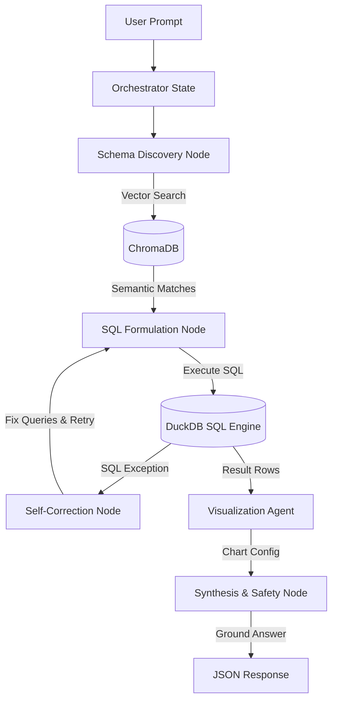

# DataPulse AI Analyst: Project Architecture & Multi-Agent Orchestration

Welcome to the **DataPulse AI Analyst** developer documentation. This guide details the system design, components, and multi-agent coordination system that powers the conversational analytics platform.

---

## 🏗️ System Overview

DataPulse AI Analyst is built on a decoupled architecture containing a fast Python FastAPI engine and a React SPA frontend:

```
┌─────────────────────────────────┐
│     Vite + React Frontend       │
│  (Tailwind CSS & Recharts SVG)  │
└────────────────┬────────────────┘
                 │ (REST API via /api/*)
                 ▼
┌─────────────────────────────────┐
│     FastAPI Python Backend      │
│  (LangGraph Orchestrated Agents)│
└────────┬───────────────┬────────┘
         ▼               ▼
┌───────────────┐ ┌───────────────┐
│    DuckDB     │ │   ChromaDB    │
│  (Analytical  │ │   (Semantic   │
│  SQL Engine)  │ │ Vector Store) │
└───────────────┘ └───────────────┘
```

---

## 🛠️ Technology Stack

### Backend Analytics Engine
* **FastAPI**: REST API host running on port `8000`.
* **DuckDB**: Local, high-performance in-memory columnar database handling 100% of analytical computations.
* **ChromaDB**: Semantic vector store mapping column metrics to natural language meanings.
* **LangGraph**: Multi-agent orchestration framework modeling logical agent states as state-machine graphs.
* **google-genai & Groq API**: Generates SQL logic and summarizes findings.

### Frontend Dashboard
* **Vite & React 19**: Responsive SPA framework.
* **Recharts**: D3-backed SVG charting engine for visual insights.
* **Tailwind CSS**: Modern UI style layout.

---

## 🤖 Multi-Agent Orchestration System

Conversational queries are processed through a structured agent state graph managed by **LangGraph**:



### 1. Orchestrator State Manager
Initializes the request state:
```python
class AgentState(TypedDict):
    query: str
    dataset_name: str
    csv_path: str
    matched_columns: List[str]
    generated_sql: str
    query_results: List[Dict[str, Any]]
    error_message: str
    correction_attempts: int
    chart: Dict[str, Any]
    answer: str
    suggested_questions: List[str]
```

### 2. Schema Discovery Agent
* Extracts semantic embeddings of the user query.
* Searches **ChromaDB** database schema collections.
* Returns exact physical column keys mapped to the matching context, preventing LLM column hallucinations.

### 3. SQL Formulation Node & Self-Correction Loop
* Translates the request into ANSI SQL.
* Runs queries against the local **DuckDB** instance.
* **Self-Correction Logic**: If DuckDB throws an error (e.g. invalid string castings or mathematical division by zero), the exception is fed directly back into the LLM context. The agent rewrites the code (up to 3 retries) until it achieves successful execution.

### 4. Visualization Agent
* Evaluates data distributions from DuckDB outputs.
* Determines whether a visual chart is necessary.
* Recommends a chart mapping specification (type, xAxisKey, yAxisKeys, aggregation logic, takeaway narrative).

### 5. Synthesis & Safety Node
* Aggregates the raw records.
* Formulates final takeaways.
* Verifies SQL queries contain only READ actions.

---

## 🔒 Execution Security (Subprocess Sandbox)

Any runtime python computations (e.g. running predictive math models or computing anomalies) are run inside the **`SubprocessSandbox`**:
* **Timeout Protections**: Limits execution to 5 seconds to prevent execution hangs or CPU DOS attacks.
* **Directory Isolation**: Forces execution inside an isolated ephemeral temporary workspace via `os.chdir(temp_dir)`. Any malicious file writes are automatically cleaned up when the subprocess terminates.

---

## 🚀 Running Locally

1. **Start Backend Server**:
   ```bash
   python -m uvicorn main:app --port 8000
   ```
2. **Start Frontend Dev Server**:
   ```bash
   npm run dev
   ```
   *The frontend runs on `http://localhost:5173/` and proxies backend routes (`/api/*`) to port `8000` automatically.*
