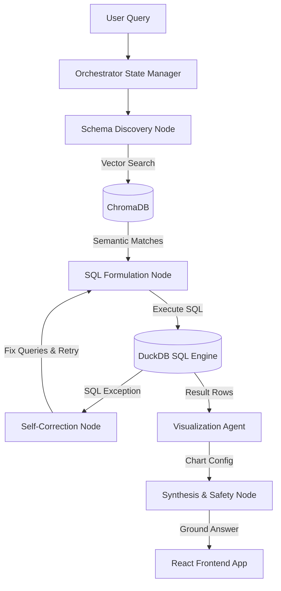

# DataPulse AI Analyst 📊🤖
> **Autonomous Multi-Agent Data Conversational & Visualization Platform**

DataPulse AI Analyst is a premium, developer-centric data screening and conversational analytics dashboard. By combining **LangGraph multi-agent orchestration**, **DuckDB analytical execution**, and **ChromaDB semantic layers**, it enables developers and business managers to upload spreadsheets, generate auto-screening narratives, and chat with an AI copilot to generate instant, mathematically accurate Recharts visualizations.

---

## ✨ Features

* **🔍 Automated Screening Dashboard**: Generates analytical summaries, business questions, trend alerts, and recommended charts immediately upon uploading.
* **💬 AI Copilot Agent (Chat Console)**: Ask mathematical questions in plain English, and watch the agents build SQL queries, correct execution errors, and render interactive visuals.
* **📊 Custom Saved Dashboard**: Pin your favorite recommended charts or statistical outputs to build custom workspaces stored in persistent browser cache.
* **🎨 Interactive Visual Studio**: Build custom visualizations by selecting dimensions (X-Axis) and metrics (Y-Axis) manually.
* **📈 Advanced Statistics**: Run automated linear regressions, forecast projections, and anomaly detection models.

---

## 🛠️ Technology Stack

* **Frontend**: React 19 (SPA), Vite 6, Tailwind CSS, Recharts (D3-backed SVG charting engine), Lucide Icons.
* **Backend**: FastAPI (Python 3.11), Uvicorn.
* **Agentic Graph**: LangGraph (multi-agent state machine coordination).
* **Database & Vector Store**: DuckDB (columnar local SQL execution), ChromaDB (semantic embedding vector database).
* **AI Model**: Llama 3.1 8B (via Groq API) for fast, highly parallel JSON schemas and SQL query generation.

---

## 🤖 Multi-Agent Orchestration Architecture

DataPulse AI Analyst leverages a LangGraph state graph. The agents communicate with each other dynamically to execute database actions:



### Coordinator Nodes:
1. **Schema Discovery Node**: Searches ChromaDB using semantic embeddings to resolve user concepts (e.g. "revenue") to exact physical database column names (`Invoiced_Revenue`), preventing LLM hallucinations.
2. **SQL Formulation Node & Self-Correction Loop**: Translates natural queries to ANSI SQL and runs them in DuckDB. If DuckDB fails, the exception is passed back to the LLM to rewrite the query (up to 3 retries) and heal itself.
3. **Visualization Agent**: Analyzes data structures and outputs chart coordinates, type matching, and aggregate definitions (e.g., Line, Scatter, Bar) for Recharts.
4. **Synthesis Node**: Evaluates raw records, aggregates insights, and wraps them in clean JSON payloads.

---

## 🔒 Security Sandbox Isolation

Mathematical models (regressions, anomaly detection) run within a **Subprocess Sandbox**:
* **Thread Bounds**: Kills executing processes after 5 seconds to prevent execution hangs or CPU exhaustion.
* **Ephemeral Workspaces**: Changes directories dynamically (`os.chdir(temp_dir)`) to isolate file system writes. All files generated are automatically garbage-collected.

---

## 🚀 Running Locally

### Prerequisites
* **Node.js** (v18+)
* **Python** (v3.10+)

### 1. Backend Setup
1. Navigate to the project root:
   ```bash
   cd datapulse-ai
   ```
2. Install Python packages:
   ```bash
   pip install -r requirements.txt
   ```
3. Set your environment variables in a `.env` file:
   ```env
   GROQ_API_KEY=your_groq_api_token
   GROQ_MODEL=llama-3.1-8b-instant
   ```
4. Start the FastAPI server:
   ```bash
   python -m uvicorn main:app --port 8000
   ```

### 2. Frontend Setup
1. In a new terminal, install npm dependencies:
   ```bash
   npm install
   ```
2. Start the Vite React development server:
   ```bash
   npm run dev
   ```
3. Access the dashboard at **`http://localhost:5173/`**.
