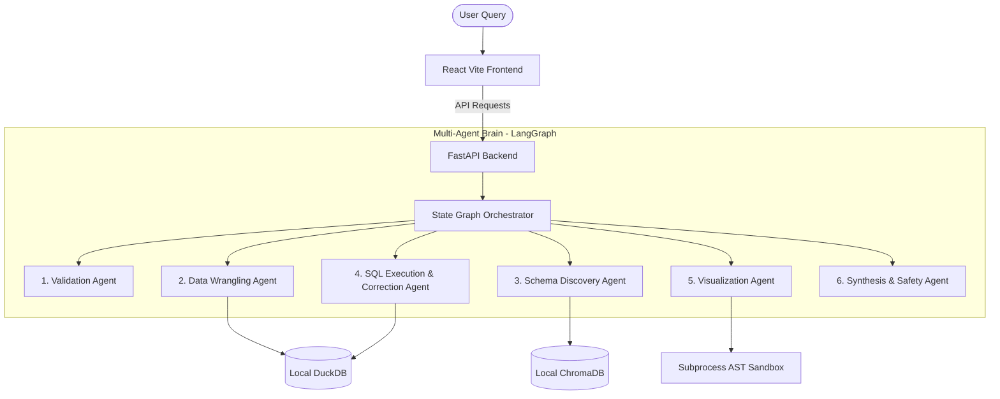

# DataPulse AI: Autonomous Multi-Agent Data Analyst

**DataPulse AI** is a production-grade, 100% free-of-cost autonomous AI data analyst agent designed for portfolio display. It replaces basic, unsafe code execution sandboxes with an enterprise architecture featuring a **Stateful Multi-Agent Orchestrator**, a **Local Semantic Schema Catalog**, a **Local Vector Database**, and a **High-Performance In-Process Analytical Engine**.

---

## 🏗️ System Architecture



---

## 🛠️ The Tech Stack

### Backend & Data Engine
*   **FastAPI & Python 3.11+**: High-performance backend router.
*   **DuckDB**: Local, in-process columnar SQL database for sub-second analytical queries.
*   **ChromaDB & Sentence-Transformers**: Local vector database utilizing the `all-MiniLM-L6-v2` embedding model to run semantic schema catalog search **free of cost**.

### Orchestration & AI
*   **LangGraph**: Stateful multi-agent graph with cyclical execution and SQL self-correction loops.
*   **Groq API (Llama 3.3 70B)**: Extremely low-latency, free-tier inference engine for SQL drafting and report synthesis.
*   **Pydantic**: Strict data validation and schema serialization.

### Frontend
*   **React (Vite + TypeScript)**: Premium, responsive dashboard.
*   **TailwindCSS**: Visual tokens, dark modes, and glassmorphic panels.
*   **Recharts**: Client-side interactive charting library.

---

## 🤖 The Multi-Agent Blueprint

Rather than relying on a single text-to-SQL prompt, the backend orchestrates **six specialized agents**:

1.  **Validation Agent**: Confirms dataset parameters, boundary limits, and file integrity.
2.  **Data Wrangling Agent**: Audits dataset data types, null rates, and applies cleaning rules.
3.  **Schema Discovery Agent**: Retrieves descriptive labels from the ChromaDB vector store matching user query context.
4.  **SQL Execution & Self-Correction Agent**: Generates DuckDB queries. If DuckDB returns a syntax error, the agent captures the traceback and **auto-corrects its code** (up to 3 retries).
5.  **Visualization Agent**: Selects chart types (Bar, Line, Area, Scatter, Pie, Radar) and output aggregates (Sum, Mean, Min, Max, Count).
6.  **Synthesis & Safety Agent**: Ground-checks details against database facts and compiles the final user response.

---

## 🚀 DevOps & Deployment

This project demonstrates a standard DevOps production pipeline:

*   **Continuous Integration (CI)**: GitHub Actions workflow ([ci.yml](.github/workflows/ci.yml)) automatically builds Node and verifies Python dependency compilation on push.
*   **Containerization**: Multi-stage [Dockerfile](Dockerfile) compiles frontend assets into static pages served directly by FastAPI, creating a single production port container.
*   **Continuous Deployment (CD)**: Ready for auto-deploy on Render or Railway connected to your repository.

---

## ⚙️ Running Locally

### Prerequisites
*   Node.js (v20+)
*   Python (v3.11+)

### 1. Setup Backend
Create a `.env` file in the root folder:
```env
GROQ_API_KEY=your_groq_api_key
GROQ_MODEL=llama-3.3-70b-versatile
```
Install dependencies and run:
```bash
pip install -r requirements.txt
python -m uvicorn main:app --port 8000
```

### 2. Setup Frontend
```bash
npm install
npm run dev
```
Open **`http://localhost:5173/`** in your browser.
