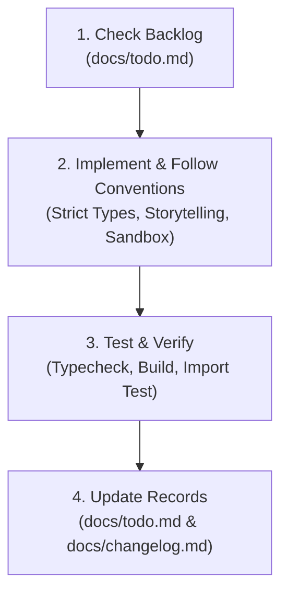

# AGENT.md — Developer & AI Agent Working Guide

> **Rules of Engagement, Architecture Conventions & Development Protocols for DataPulse AI Analyst**  
> *Last Updated: 2026-10-02 | Version: 1.0*

---

## 1. Project Overview & Philosophy

**DataPulse AI Analyst** is an autonomous multi-agent data analytics and conversational intelligence platform. It enables users to upload tabular data (CSV, TSV, Excel), automatically screen for anomalies and key metrics, and converse with an AI copilot that formulates DuckDB SQL queries, performs machine learning / statistical routines in an isolated sandbox, and renders dynamic Recharts visualizations.

### Core Philosophy
* **Storytelling Over Raw Code**: We never dump raw JSON or raw numbers without business context. Every quantitative output must include a clear, executive-grade analytical narrative explaining what the data indicates and recommended next steps.
* **Autonomous Self-Correction**: The SQL execution engine intercepts errors and retries (up to 3 times) with LLM feedback before failing gracefully.
* **Zero Data Loss**: User datasets and storage are strictly treated as read-only. Destructive SQL (`DROP`, `DELETE`, `TRUNCATE`) is blocked.

---

## 2. Repository Layout & Documentation Directory

All documentation is centralized inside the `docs/` folder:

```
datapulse-ai/
├── docs/                               # 📖 Centralized Documentation Directory
│   ├── agent.md                        # This file: Guide on how agents work in this project
│   ├── implementation_plan.md          # Comprehensive architecture & phased technical roadmap
│   ├── todo.md                         # Active backlog, milestones, and task tracking
│   ├── changelog.md                    # Keep-a-Changelog record of all historical changes
│   └── README.md                       # Quick index to project documentation
├── backend/                            # 🐍 FastAPI REST Server & AI Agents
│   ├── main.py                         # REST endpoints & static file serving
│   ├── semantic_store.py               # ChromaDB vector store for schema metadata
│   ├── requirements.txt                # Python dependencies
│   ├── utils/
│   │   └── llm.py                      # Unified LLM provider client (Groq & OpenRouter)
│   └── agents/
│       ├── nodes.py                    # LangGraph node definitions & AgentState schema
│       ├── orchestrator.py             # StateGraph cyclic workflow definition
│       └── sandbox.py                  # Isolated SubprocessSandbox for Python ML code
├── frontend/                           # ⚛️ React 19 + TypeScript + Vite SPA
│   ├── package.json                    # Frontend dependencies & npm scripts
│   ├── vite.config.ts                  # Vite build config with /api proxy to port 8000
│   ├── tsconfig.json                   # Strict TypeScript compiler options
│   └── src/                            # React components, styles, and utilities
├── Dockerfile                          # Multi-stage production container build
├── .github/workflows/                  # GitHub Actions CI & Hugging Face deployment
├── .env.example                        # Environment variables template
├── README.md                           # Main repository README
└── agent.md                            # Root link to docs/agent.md
```

---

## 3. How We Work in This Project (Agent Protocol)

Whenever an AI agent or developer undertakes work in this repository, they MUST adhere to this 4-step protocol:



### Step 1: Check & Update `docs/todo.md`
* Before starting a task, consult [`docs/todo.md`](file:///d:/AI%20data%20analyst/datapulse-ai/docs/todo.md) to understand current milestones, priorities, and dependencies.
* Mark the task as in-progress `[-]` or completed `[x]`.

### Step 2: Implement Following Architectural Conventions
* **Decoupled Imports**: Python modules inside `backend/` must support execution both from project root and from within `backend/`. Ensure safe `sys.path` injection or fallback imports.
* **LangGraph Nodes**: Every agent node must accept `AgentState` and return a dictionary with incremental updates. Always append descriptive objects to `state.agent_steps` so frontend users can view agent thoughts.
* **Visualization Integrity**: When the Visualization agent recommends chart keys, cross-verify that `xAxisKey` and `yAxisKeys` exist in the SQL result set. Never invent keys.
* **ML Best Practices**:
  * For regressions and forecasting, perform chronological train/validation splits **before** any feature transformations.
  * Always calculate and explain missing value statistics and outliers ($1.5 \times \text{IQR}$).
  * Run arbitrary Python statistical code inside `SubprocessSandbox`.

### Step 3: Local Verification & Quality Gates
* **Never commit broken code**. Always run the following verification commands before concluding work:
  1. Frontend TypeScript & Build:
     ```bash
     # From frontend/
     cmd.exe /c "npm run build"
     ```
  2. Backend Syntax Check:
     ```bash
     # From project root
     python -m compileall backend
     ```
  3. Backend Import Check:
     ```bash
     # From backend/
     python -c "import main; print('Backend loaded successfully')"
     ```

### Step 4: Record Changes in `docs/changelog.md`
* Log completed features, refactorings, or bug fixes under the `[Unreleased]` section in [`docs/changelog.md`](file:///d:/AI%20data%20analyst/datapulse-ai/docs/changelog.md) using standard categories: `Added`, `Changed`, `Fixed`, or `Removed`.

---

## 4. Key Development Commands

### Frontend (`frontend/`)
```bash
# Install dependencies
npm install

# Start Vite React development server (Port 5173, proxies /api -> http://localhost:8000)
npm run dev

# Production build test
cmd.exe /c "npm run build"
```

### Backend (`backend/`)
```bash
# Install Python dependencies
pip install -r backend/requirements.txt

# Start FastAPI development server (Port 8000)
python -m uvicorn main:app --reload --port 8000

# Syntax check all backend modules
python -m compileall backend
```

---

## 5. Security & Safety Guardrails

1. **Subprocess Isolation**: Any Python code execution must use `SubprocessSandbox(timeout_seconds=15)` which isolates execution inside a temporary directory and enforces memory/CPU timeout limits.
2. **API Keys**: Never hardcode API keys (`GROQ_API_KEY`, `OPENROUTER_API_KEY`, `HF_TOKEN`). Read them via `python-dotenv` from `.env`.
3. **DuckDB Protection**: Keep user tables in in-memory DuckDB (`:memory:`) or read-only view modes.
