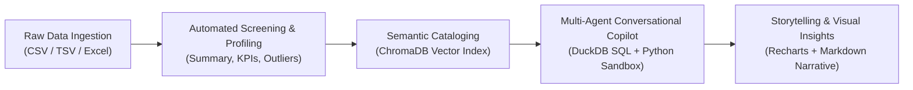
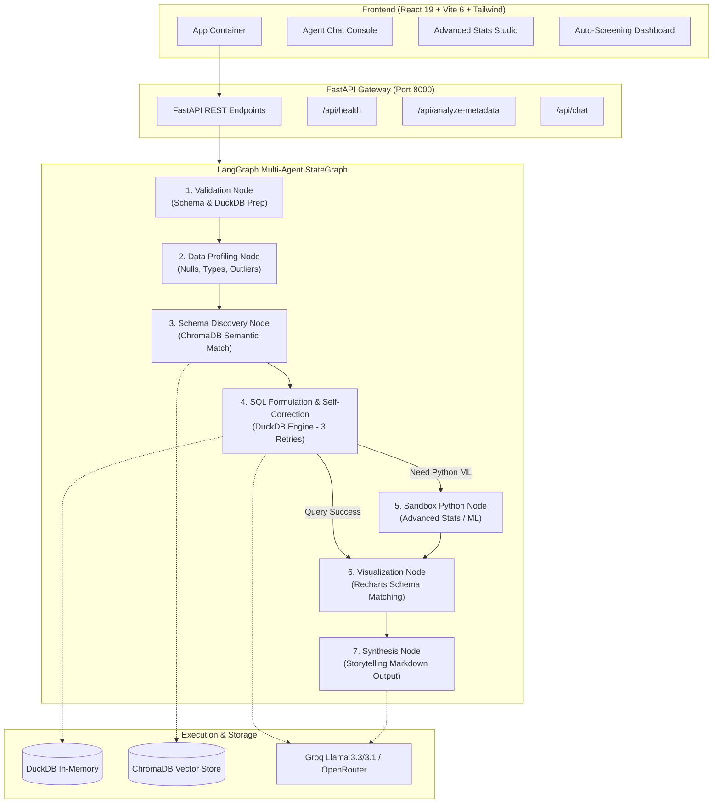

# DataPulse AI Analyst — Architecture, Best Practices & Implementation Plan

> **Comprehensive Engineering Blueprint & Implementation Roadmap**  
> *Last Updated: 2026-10-02 | Version: 1.0*

---

## 1. System Vision: What the System Should Do

**DataPulse AI Analyst** is designed as an autonomous, full-stack data copilot that bridges the gap between raw datasets (CSV, Excel) and actionable executive intelligence. Rather than simply returning raw numbers or static plots, the system must **tell a coherent data story**:



### Core System Responsibilities:
1. **Automated Ingestion & Profiling**:
   * Instantly ingest uploaded tabular data, detect types, identify null counts, and compute baseline distributions.
   * Generate an immediate "Executive Screening Report" with key metrics, anomaly alerts, and suggested exploration questions.
2. **Conversational Multi-Agent Copilot**:
   * Parse natural language queries into safe analytical workflows.
   * Execute high-speed SQL via DuckDB with an **autonomous self-correction loop** (up to 3 retries on syntax or alias errors).
   * Cross-join multiple datasets in memory seamlessly.
3. **Statistical & ML Analytical Engine**:
   * Apply structured ML workflows (exploratory anomaly detection, linear/polynomial regressions, forecasting, and clustering).
   * Guarantee **strict featurization ordering** and metric transparency ($R^2$, RMSE, Silhouette scores, residuals).
4. **Interactive Dashboard & Visualization Studio**:
   * Recommend mathematically sound charts (bar, line, scatter, area, radar) without hallucinating axis keys.
   * Allow users to pin visual assets to a persistent custom workspace and export executive PDF/Excel reports.

---

## 2. Engineering Best Practices Applied

### A. Machine Learning & Analytical Best Practices (`ml-best-practices`)
* **Data Storytelling Over Raw Output**: Every quantitative query must produce an analytical narrative explaining *what* happened, *why* it matters, and *what actions* are suggested.
* **Strict Preprocessing & Featurization Order**: For predictive models (forecasts, regressions), always split training and evaluation data **before** computing normalization, scaling, or encodings to prevent data leakage.
* **Missing Value & Anomaly Audits**: Explicitly audit null values, categorize missingness (MCAR vs. MAR), and flag statistical anomalies (IQR $\ge 1.5 \times \text{IQR}$ or $|Z| > 3$) before aggregation.
* **Sandboxed Code Execution**: Mathematical modeling and regressions requiring arbitrary Python code must run inside the `SubprocessSandbox` with 5-second process bounds and ephemeral filesystem cleanup.

### B. Modern Data Application Standards (`building-data-apps`)
* **Visual Hierarchy**: Card-based layouts with minimal chrome; dark/zinc color palette with contrasting semantic indicators (green for positive trends, amber/red for anomalies).
* **Typography Distinction**: Clean sans-serif (`Inter` or `DM Sans`) for conversational narratives; monospaced font (`JetBrains Mono`) for SQL queries, table figures, and code metrics.
* **Responsive Recharts Architecture**: Dynamic container sizing, tooltip formatting, formatted number abbreviations ($1.2\text{M}$ instead of $1200000$), and explicit error boundaries.

### C. Backend & Multi-Agent Architecture
* **Decoupled Package Execution**: Code must be runnable both as a modular package (`from backend.utils.llm import ...`) and locally inside `backend/` without import path conflicts.
* **In-Memory Columnar Speed**: DuckDB `:memory:` sessions should cache tables for the duration of the active session rather than reading from disk on every single query.

---

## 3. How the System Should Do It (Technical Architecture)



---

## 4. Phased Implementation Plan

### Phase 1: Environment & Import Stabilization (Immediate Priority)
- **Problem**: In `backend/main.py`, `backend/agents/nodes.py`, and `backend/agents/orchestrator.py`, hardcoded `from backend.*` imports fail when running directly inside the `backend/` directory or in Docker (`ModuleNotFoundError: No module named 'backend'`).
- **Action**:
  1. Add a safe `sys.path` resolver at the top of backend modules:
     ```python
     import sys, os
     sys.path.insert(0, os.path.abspath(os.path.join(os.path.dirname(__file__), "..")))
     ```
     Or support fallback imports (`try: from backend.x import y except ImportError: from x import y`).
  2. Verify that `python -c "import main"` passes inside `backend/` and that the `.github/workflows/ci.yml` step succeeds.
  3. Commit and push the folder refactoring to `origin/main`.

### Phase 2: Upgrading Data Wrangling & Profiling
- **Current State**: `data_wrangling_node` is currently a stub that only returns a static step.
- **Implementation**:
  1. Calculate real column metrics using DuckDB:
     * Non-null counts and percentage of missing values.
     * Numerical quantiles (25%, median, 75%), mean, min, max, standard deviation.
     * Categorical cardinalities and top 3 dominant values.
  2. Store summary statistics in `AgentState.data_profile` to supply exact numeric context to the SQL and synthesis agents.

### Phase 3: Wiring the Python ML Sandbox (`backend/agents/sandbox.py`)
- **Current State**: `SubprocessSandbox` exists with isolated directory execution and timeouts, but is not connected to the agent flow or REST API.
- **Implementation**:
  1. Add a conditional edge in `backend/agents/orchestrator.py`:
     * If user intent is statistical/ML (e.g., *"predict"*, *"forecast"*, *"regression"*, *"cluster"*, *"correlate"*), route to a new `python_sandbox_node`.
     * The agent writes isolated Python code utilizing `scikit-learn` / `statsmodels` / `numpy`, executes within `SubprocessSandbox`, and extracts structured coefficients and metrics.
  2. Implement `ml-best-practices` safeguards:
     * Require time series models to perform chronological train/validation splits.
     * Require linear regressions to report $R^2$, MAE, and residual distributions.
     * Require clustering to report silhouette scores across multiple $k$ values ($k \in [2, 6]$).

### Phase 4: Conversational Streaming & Thought Visualization
- **Current State**: Responses wait for all LangGraph nodes to finish before returning a full JSON response.
- **Implementation**:
  1. Add FastAPI Server-Sent Events (SSE) via `StreamingResponse` on `POST /api/chat/stream`.
  2. Stream node lifecycle events to `AgentChatConsole.tsx` so users see:
     * 🟢 *Validating schema...*
     * 🔍 *Searching ChromaDB semantic embeddings...*
     * ⚡ *Executing DuckDB query...* (and self-correcting if a retry occurs)
     * 📊 *Rendering visualization...*

### Phase 5: UI Polish & Export Enhancements
- **Current State**: Basic PDF export via html2canvas.
- **Implementation**:
  1. Format all numerical values in tables and tooltips with humanized abbreviations (e.g. `$2.4M`, `84.5%`).
  2. Add CSV/Excel download buttons directly from the chat code block results.
  3. Support multi-dataset upload and management from `DatasetSelector.tsx`.

---

## 5. Key Architecture Recommendations

| # | Recommendation | Why It Matters |
|---|---|---|
| **1** | **Session-Persistent DuckDB Connections** | Currently, `CREATE TABLE` runs on every question. Using a persistent DuckDB connection per dataset session eliminates redundant CSV parsing for queries on multi-million row datasets. |
| **2** | **Hybrid Query Router (SQL vs. Python)** | SQL is optimal for filtering, grouping, and aggregations. Python is required for regressions, clustering, and forecasting. Routing intelligently between DuckDB and `SubprocessSandbox` gives the best of both worlds. |
| **3** | **Groq Tool Calling (Structured Output)** | Instead of raw prompt engineering for JSON, use Groq's tool-calling or Pydantic JSON schema constraints to reduce JSON parsing errors in `backend/utils/llm.py`. |
| **4** | **Recharts Type Guarding** | Ensure the Visualization Agent cross-checks the inferred chart type with the data cardinality (e.g., never recommend a Pie chart if cardinality $> 7$, switch to Bar instead). |
| **5** | **Zero-Loss Data Safety** | Strictly enforce read-only DuckDB commands (`SELECT`, `WITH`) and block any `DROP`, `UPDATE`, or destructive operations. |
